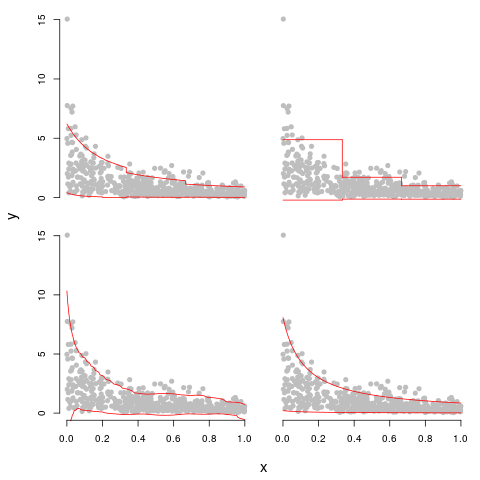
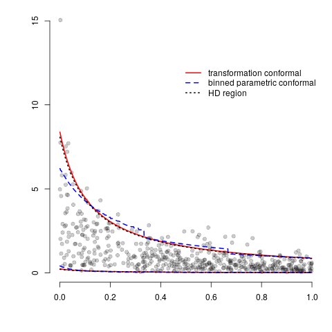

# R package conformal.glm 

## Conformal Prediction for Generalized Linear Regression Models

This package computes and compares prediction regions for the normal, Gamma, 
and inverse Gaussian families in the `glm` package.  There is functionality to 
construct the binned and transformation parametric conformal prediction 
regions and the binned nonparametric conformal prediction region. 


## Usage 

```r
library(devtools)
install_github(repo = "DEck13/conformal.glm", subdir="conformal.glm")
library(HDInterval)
library(MASS)
library(parallel)
```

## Illustrative Example 

We provide a gamma regression example with perfect model specification to 
illustrate the performance of conformal predictions when the model is known 
and the model does not have additive symmetric errors.  We also compare 
conformal prediction regions to the oracle highest density region under 
the correct model. This example is included in the corresponding paper:  

  Eck, D.J. and Crawford, F.W. (2019+)
  Conformal prediction for exponential families and generalized linear models.
  Preprint available on request (email dje13@illinois.edu).

```r
alpha <- 0.10
n <- 500
shape <- 2
beta <- c(1/4, 2)

set.seed(13)
x <- matrix(runif(n), ncol = 1)
rate <- cbind(1, x) %*% beta * shape
y <- rgamma(n = n, shape = shape, rate = rate)
data.readme <- data.frame(y = y, x = x)
colnames(data.readme)[2] <- c("x1")

fit.readme = glm(y ~ x1, family = Gamma, data = data.readme)
```


Compute the binned and transformation parametric conformal prediction regions 
and the binned nonparametric conformal prediction region.
```r
bins <- 3
system.time(cpred <- conformal.glm(fit.readme, 
  nonparametric = TRUE, bins = bins, cores = 6, 
  method = "both"))
parabinCI <- cpred$paraconfbin
nonparabinCI <- cpred$nonparaconfbin
transformCI <- cpred$transformconf
```


Compute the least squares conformal prediction region with local 
weighting (LSLW) using the conformalInference package.
```r
## least squares conformal prediction region
library(conformalInference)
funs <- lm.funs(intercept = TRUE)
train.fun <- funs$train.fun
predict.fun <- funs$predict.fun

cubic.model <- lm(y ~ x + I(x^2) + I(x^3))
abs.resid <- abs(cubic.model$resid)
smooth.call <- smooth.spline(x, abs.resid, 
  nknots = 10)
lambda <- smooth.call$lambda
df <- smooth.call$df
mad.train.fun <- function(x, y, out = NULL){
  smooth.spline(x[, 1], y, lambda = lambda, 
    df = df, nknots = 10)
}
mad.predict.fun <- function(out, newx){
  predict(out, newx[, 1])$y
}
system.time(p1.tibs <- conformal.pred(x = cbind(x,x^2,x^3), 
  y = y, x0 = cbind(x,x^2,x^3), 
  train.fun = train.fun, predict.fun = predict.fun, 
  mad.train.fun = mad.train.fun,
  mad.predict.fun = mad.predict.fun,
  alpha = alpha))
LSLW = cbind(p1.tibs$lo, p1.tibs$up)
```


Compute the highest density (HD) prediction region.
```r
betaMLE <- coefficients(fit.readme)
shapeMLE <- as.numeric(gamma.shape(fit.readme)[1])
rateMLE <- cbind(1, x) %*% betaMLE * shapeMLE
HDCI <- do.call(rbind, 
  lapply(1:nrow(x), function(j){ 
    hdi(qgamma, 0.90, shape = shapeMLE, rate = rateMLE[j, 1])
  }))
```


## Plot of all prediction regions

Four of the five prediction regions are depicted below.  
The top row depicts the transformation parametric conformal prediction 
region (left panel) and the binned parametric conformal prediction region 
(right panel).  The bottom row depicts the binned nonparametric 
conformal prediction region (left panel) and the LSLW conformal prediction 
region (right panel).  The bin width was specified as 1/3 for the binned 
conformal prediction regions.  We see that the binned parametric conformal 
prediction region is a close discretization of the transformation conformal 
prediction region, the nonparametric conformal prediction region is quite 
jagged and unnatural, and the LSLW conformal prediction region includes 
negative response values and is jagged. 

```r
#########################################
## make plot
par(mfrow = c(2,2), oma = c(4,4,0,0), mar = c(1,1,1,1))

# transformation conformal prediction region
ix <- sort(x, index.return = TRUE)$ix
plot.new()
plot.window(xlim = c(0,1), ylim = c(min(y), max(y)))
points(x, y, pch = 19, col = rgb(0,0,0,alpha=0.2))
lines(x[ix], transformCI[ix, 1], type = "l", col = "red")
lines(x[ix], transformCI[ix, 2], type = "l", col = "red")
axis(2)

# parametric conformal prediction region
ix <- sort(x, index.return = TRUE)$ix
plot.new()
plot.window(xlim = c(0,1), ylim = c(min(y), max(y)))
points(x, y, pch = 19, col = rgb(0,0,0,alpha=0.2))
lines(x[ix], parabinCI[ix, 1], type = "l", col = "red")
lines(x[ix], parabinCI[ix, 2], type = "l", col = "red")

# nonparametric conformal prediction region
plot.nonparametric <- function(region, x, y, bins){
  if(class(region) != "list"){ 
    stop("Only appropriate for nonparametric conformal prediction region")
  }
  plot.new()
  plot.window(xlim = c(0,1), ylim = c(min(y), max(y)))
  points(x, y, pch = 19, col = rgb(0,0,0,alpha=0.2))
  for(i in 1:bins){ 
    nonpar.i  <- nonparabinCI[[i]]
    odd <- which(1:length(nonpar.i) %% 2 == 1) 
    even <- which(1:length(nonpar.i) %% 2 == 0)
    segments(x0 = 1/bins * (i-1), y0 = nonpar.i, x1 =1/bins * i, 
      col = "red")
    if(i != 1){ 
      nonpar.i.previous <- nonparabinCI[[i-1]]
      nonpar <- sort(c(nonpar.i, nonpar.i.previous))
      odd2 <- which(1:length(nonpar) %% 2 == 1) 
      even2 <- which(1:length(nonpar) %% 2 == 0)
      segments(x0 = 1/bins * (i-1), y0 = nonpar[odd2], 
        y1 = nonpar[even2], col = "red")
    }
  }
}    
plot.nonparametric(nonparabinCI, x = x, y = y, bins = bins)
axis(1); axis(2)

# least squares conformal prediction region
plot.new()
plot.window(xlim = c(0,1), ylim = c(0,max(y)))
points(x, y, pch = 19, col = rgb(0,0,0,alpha=0.2))
lines(x[ix], LSLW[ix, 1], type = "l", col = "red")
lines(x[ix], LSLW[ix, 2], type = "l", col = "red")
axis(1)

# axis labels
mtext("x", side = 1, line = 2.5, outer = TRUE, cex = 1.25)
mtext("y", side = 2, line = 2.5, outer = TRUE, cex = 1.25)
```




We see that the transformation parametric conformal prediction region closely 
resembles the HD prediction region, and that the binned parametric conformal 
prediction region is a close descretization of the HD prediction region.

```r
par(mfrow = c(1,1), oma = c(4,4,0,0), mar = c(1,1,1,1))
plot.new()
plot.window(xlim = c(0,1), ylim = c(min(y), max(y)))
points(x, y, pch = 19, col = rgb(0,0,0,alpha=0.2))
lines(x[ix], transformCI[ix, 1], type = "l", lwd = 2, col = "red")
lines(x[ix], transformCI[ix, 2], type = "l", lwd = 2, col = "red")
lines(x[ix], parabinCI[ix, 1], type = "l", lwd = 2, lty = 2, col = "blue")
lines(x[ix], parabinCI[ix, 2], type = "l", lwd = 2, lty = 2, col = "blue")
lines(x[ix], HDCI[ix, 1], type = "l", lwd = 2, lty = 3, col = "black")
lines(x[ix], HDCI[ix, 2], type = "l", lwd = 2, lty = 3, col = "black")
axis(1); axis(2)
legend(0.55, 12.5, legend=c("transformation conformal", 
  "binned parametric conformal", "HD region"), 
  col=c("red", "blue", "black"), cex = 1, lwd = c(2, 2, 2),
  lty=c(1, 2, 3), bty = "n")
```





## Coverage properties and estimated area of all prediction regions

All of the presented prediction regions exhibit close to finite-sample 
marginal validity and local validity with respect to binning.  However, 
the transformation conformal prediction region, LSLW conformal prediction 
region, and the HD prediction region do not exhibit finite-sample local 
validity in the second bin and the HD prediction region does not quite 
possess finite-sample marginal validity.  
The binned parametric conformal prediction region is smallest in size 
with an estimated area of 2.19.  The HD prediction region is a close second 
with an estimated area of 2.21.  The tranformation conformal prediction 
region is a respectable third with an estimated area of 2.26.
LSLW conformal prediction region has an estimated area of 2.56 and 
The nonparametric conformal prediction region has an estimated area of 2.68. 
Under correct model specification, the parametric conformal prediction 
regions are similar in performance to that of the highest density prediction 
region.


```r
#########################################
## area and coverage

# estimated area of prediction regions
area <- c(
  mean(apply(transformCI, 1, diff)),
  mean(apply(parabinCI, 1, diff)),
  area.nonparametric(nonparabinCI),
  mean(apply(LSLW, 1, diff)),
  mean(apply(HDCI, 1, diff))
)

# marginal local coverage of prediction regions
p <- 1
marginalcov <- c(
  local.coverage(region = transformCI, data = data.readme, d = p, 
    bins = 1, at.data = "TRUE"),
  local.coverage(region = parabinCI, data = data.readme, d = p, 
    bins = 1, at.data = "TRUE"),
  local.coverage(region = nonparabinCI, data = data.readme, d = p, 
    nonparametric = "TRUE", bins = 1, at.data = "TRUE"),
  local.coverage(region = LSLW, data = data.readme, d = p, 
    bins = 1, at.data = "TRUE"), 
  local.coverage(region = HDCI, data = data.readme, d = p, 
    bins = 1, at.data = "TRUE")
)

# local coverage of prediction regions
localcov <- cbind(
  local.coverage(region = transformCI, data = data.readme, d = p, 
    bins = bins, at.data = "TRUE"),
  local.coverage(region = parabinCI, data = data.readme, d = p, 
    bins = bins, at.data = "TRUE"),
  local.coverage(region = nonparabinCI, data = data.readme, d = p, 
    nonparametric = "TRUE", bins = bins, at.data = "TRUE"),
  local.coverage(region = LSLW, data = data.readme, d = p, 
    bins = bins, at.data = "TRUE"),
  local.coverage(region = HDCI, data = data.readme, d = p, 
    bins = bins, at.data = "TRUE")
)

# diagnostics
diagnostics <- rbind(area, marginalcov, localcov)
colnames(diagnostics) <- c("transformCI", "binparaCI",  
  "binnonparaCI", "LSLW", "HDCI")
diagnostics
```


To cite this package:
```r
citation("conformal.glm")
```


## Further details

For more details on the parametric conformal prediction region, see:

  Eck, D.J. and Crawford, F.W. (2019+)
  Conformal prediction for exponential families and generalized linear models.
  Preprint available on request (email dje13@illinois.edu).

For more details on the prediciton region formed from conformalization of 
residuals, see:

  Lei, J., G'Sell, M., Rinaldo, A., Tibshirani, R., and Wasserman, L. (2016)
  Distribution-Free Predictive Inference for Regression. 
  https://arxiv.org/abs/1604.04173

For more details on the nonparametric conformal prediction region, see:

  Lei, J. and Wasserman, L. (2014)
  Distribution-Free Prediction Bands for Non-parametric Regression. 
  Journal of the Royal Statistical Society: Series B, 76(1), 71-96.

